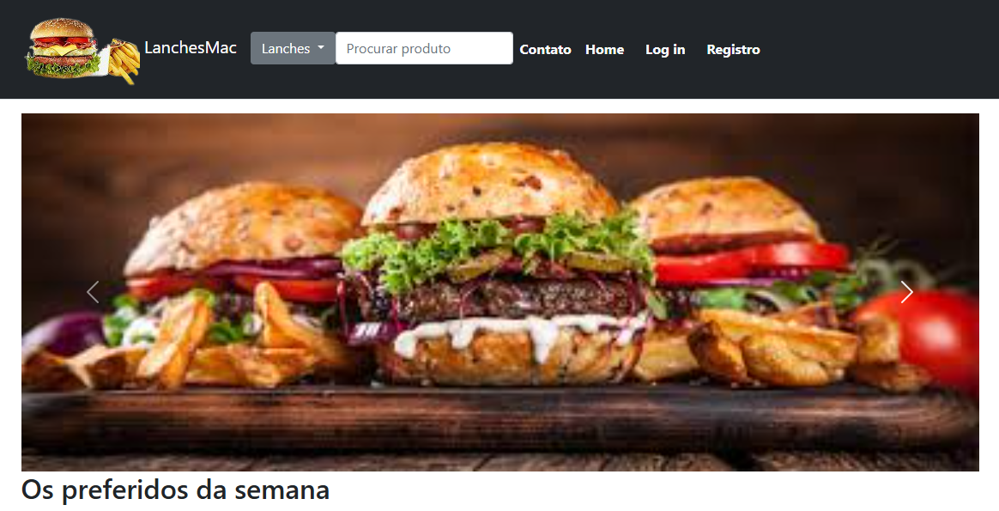

Projeto MVC - Ana Júlia de Lima Aguiar Leite

        

      

Este é um projeto em ASP .NET Core MVC feito no Visual Studio 2022.

Estou trabalhando neste projeto desde o dia 07/04/2025 até o dia 18/05/2025.

Datas válidas para a entrega do projeto entre os dias 13/06/2025 até 27/06/2025.

O Projeto Contém uma página index, contato, os tipos de lanches, login, uma aba de busca e registro.

O Script do SQL Server foi enviado separadamente para que o professor consiga rodar o projeto juntamente com o Banco de Dados.

